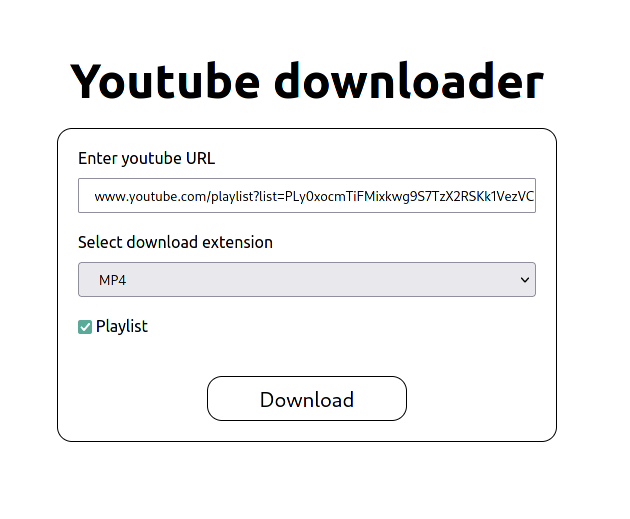

# YouTube downloader

* download videos as mp3 files
* download videos as mp4 files
* download playlists 

## Usage
* `git clone https://github.com/juanArias8/youtube-downloader.git`
* `pip install -r requirements.txt`
* `FLASK_APP=app.py FLASK_ENV=development flask run --port 5000`
* open `http://localhost:5000/` in a browser
* enjoy